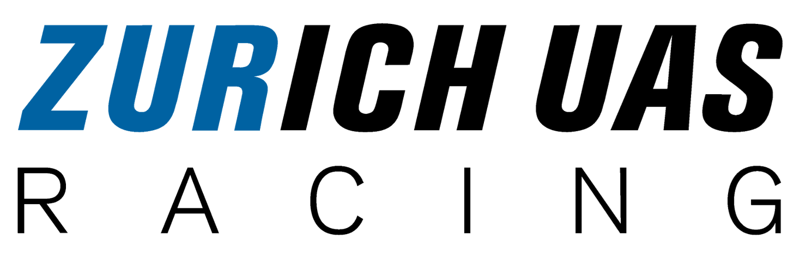
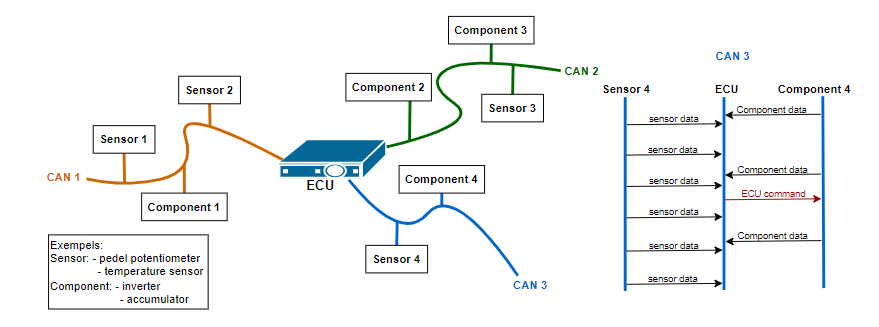
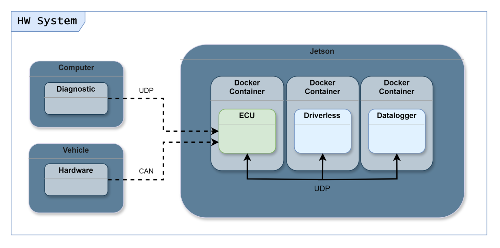
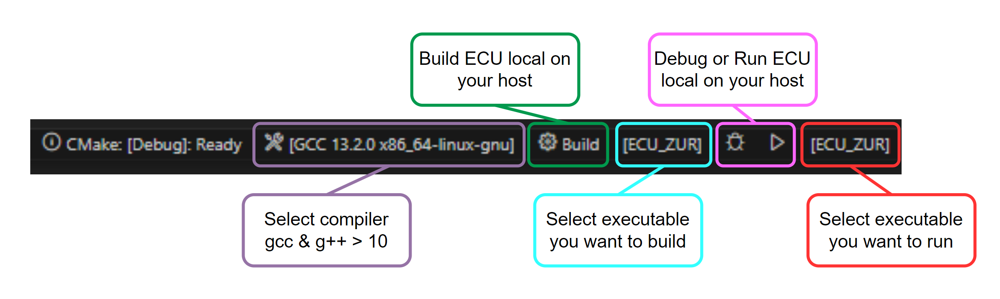

# Vehicle software including driverless API
This repository contains the code for the Electronic Control Unit (ECU) developed for the Zurich University of Applied Sciences (ZHAW) Formula Student racing car. The ECU is a critical component, facilitating communication between various car systems and ensuring smooth operation, both in driver-operated and driverless modes.
## Project Overview🏎️
The ECU software was designed with three key considerations in mind: modularity, maintainability and readability. These features ensure that future team members can easily adapt and extend the codebase, enhancing the software's long-term usability and flexibility. The ECU software has been designed to run on any Debian-based Linux platform. The only hardware requirements are that it must have physical CAN buses. Further information on the architecture and basic functions of the ECU can be found in the bachelor's thesis, which can be accessed via the following link: [Vehicle_software_incl__Driverless_connection](Doc/InES_BA24_Formula_Student__Vehicle_software_incl__Driverless_connection.pdf).


#### __Key Software Features__

* __Modular Architecture:__ The software is structured to allow easy integration of new components or systems with minimal changes to existing code.
* __CAN Communication:__ Implements a robust CAN bus communication system that handles data exchange between various vehicle components.
* __Driverless Functionality:__ Supports autonomous driving features, including brake, throttle, and steering control.
* __Server Communication:__ Provides interfaces for external applications to interact with the ECU, supporting diagnostics, data logging, and real-time vehicle control.

#### __Race Car Overview__
The entire race car control system has been designed in accordance with the principle of the centralised ECU. This configuration provides the car with a single ECU, which serves as the control hub for the vehicle's entire control system. This allows the ECU to have complete access and control over all vehicle components and sensors over a CAN bus, which streamlines data logging and facilitates the modification of vehicle logic.



The control unit in the racing car runs on an Nvidia Jetson Orin Nx platform with a baseboard developed by the [Institute of Embedded Systems (InES)](https://blog.zhaw.ch/high-performance/2024/03/11/nvidia-jetson-orin-nx-modular-vision-system/) at the ZHAW. The driverless system also runs in parallel on this platform.  By using a single hardware setup for both the ECU and the autonomous driving system, we can potentially reduce weight and costs. This approach minimizes the need for additional cables, which are both heavy and slow, thus streamlining communication between the two systems. 




## Repository Structure 📝

* **`.config/`**: Contains configuration files for CAN bus mappings, server settings, and other customizable parameters.
* **`Doc/`**: Documentation related to the project, including design documents.
* **`include/`**: Header files for the project.
* **`source/`**: Main C++ source code for the ECU.
* **`scripts/`**: Scripts required to install and run the ECU in a Debian-Linux environment.
* **`tests/`**: Unit tests and necessary libraries for testing.
* **`libraries/`**: Libraries used in the ECU software.
* **`.kernel/`**: Modified device tree files necessary for flashing the Nvidia Jetson.
* **`.module/`**: Contains custom kernel modules necessary for the Nvidia Jetson, especially for the custom baseboard.


## Installation 🛠️
The control unit was primarily developed for operation on an Nvidia Jetson platform with a custom baseboard that has three CAN buses. However, it is also possible to operate the ECU on an alternative Debian-Linux platform, provided it has functional CAN bus support. Alternatively, if if you have a Linux system without CAN bus capabilities, you can use a virtual CAN bus on your Linux PC or a virtual machine to test the ECU.

#### There are basically three different installation options:
- Installation on Nvidia Jetson (used for the race car)
- Installation on Linux with physical CAN
- Installation on Linux without physical CAN (used vor development on an VM or an othe PC)

#### 1. Clone the ECU reposetory
To clone the ECU repository, use the following command:
```bash
  git clone -b main https://github.com/zurich-uas-racing/ECU.git
```

#### 2. Run ECU-Install script
The **`script/ecu_install.sh`** script guides you through the entire installation process. It will prompt you to select the platform on which you want to run the ECU, whether you have a physical CAN bus, and if you wish to develop the ECU or just run it.

Navigate to the ECU directory and execute the installation script:
```bash
  cd ECU
  bash ./script/ecu_install.sh
```
⚠️Attention this script will make permanent changes to your pc which will still be present after a reboot⚠️

To undo the permanent changes, execute the **`script/ecu_deinstall.sh`** script.
```bash
  cd ECU
  bash ./script/ecu_deinstall.sh
```
#### 3. Run ECU
To run the ECU in a Docker container in attached mode (allowing you to view ECU logs and enter commands into the ECU terminal), use the following command:
```bash
  ecu_run

  or

  cd ECU
  ./scripts/run.sh
```
#### 4. Setup development envirement (only for ECU developers)
For ECU development, we recommend using Visual Studio Code, as it simplifies the development process with the help of appropriate extensions. You can either use VS Code directly on the ECU PC or on a host machine that accesses the ECU PC via SSH.

__The following VS Code extensions are required:__
* C/C++
* CMake Tools
* Remote Explorer
* Remote-SSH

With the help of the CMake status bar at the bottom of the VS Code window, building the ECU using CMake and running it directly on the PC becomes very straightforward.



If the CMake status bar is not visible or is only partly visible, set it in the VS code settings under **Extensions->CMake Tools->Cmake>Options: Status Bar Visibility** to be visible.

## Documentation

Further documentation such as user manual, API documentation, vehicle system overview and ECU cheats can be found on the Notion.so page of Zurich UAS Racing under Electrics/Electronic_control_unit.

[Documentation](https://www.notion.so/zurich-uas-racing/Electronic-Control-Unit-aa3233659f5042f9acf4e0d0d5309f51)

## Authors

- [@Timbo28](https://www.github.com/Timbo28)

## Race Car Pictures 📷

[🌐 Zürich UAS Racing Instagram](https://www.instagram.com/zurichuasracing/)

